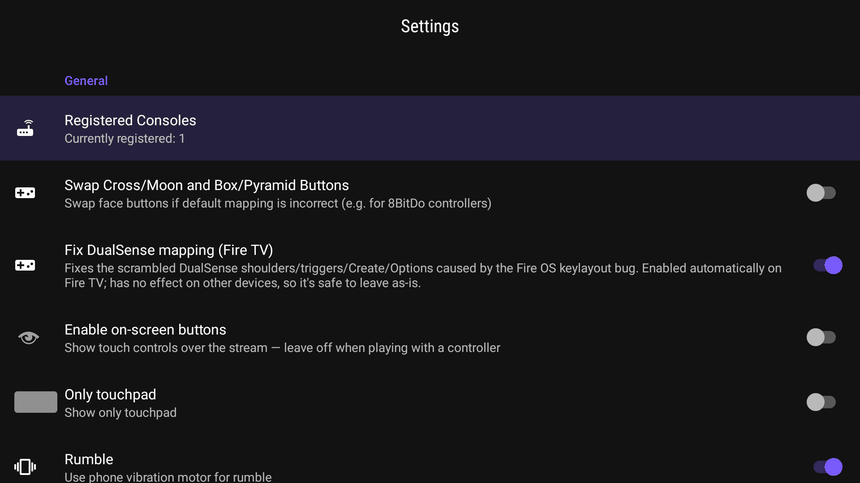

# akichi

A PlayStation Remote Play client for Fire TV and Android TV. It streams your PS5 or PS4
to a TV box so you can play with a controller, over your home network or the internet.

I made it because the existing Remote Play apps don't really hold up on a Fire TV. You
pair a DualSense and the buttons come out scrambled. You try to start a session and half
the time you can't even select your console with the remote. akichi fixes both of those,
and it's built around the remote instead of a phone touchscreen.



> Independent project, not affiliated with or endorsed by Sony. "PlayStation", "PS4" and
> "PS5" are trademarks of Sony Interactive Entertainment.

## What it does

**Fixes the DualSense on Fire TV.** On Fire OS the DualSense button layout is wrong: L1 and
R1 act like the triggers, and Options and Create do nothing. It's a bug in the keylayout
Amazon ships, not your controller. akichi corrects the mapping before it reaches your PS5.
On by default on Fire TV, no effect anywhere else. There's a
[longer write-up](https://vargasvini.github.io/akichi/fix-dualsense-fire-tv.html) if you
want to know why it happens.

**Made for a remote.** You navigate the whole app with the D-pad, with a clear highlight so
you always know what's selected. Consoles show up on their own when they're on the same
network. Everything you need is in the top bar.

**PSN sign-in without the hassle.** Most clients make you find your PSN account ID by running
scripts. Here you sign in once and it fills in for you. You can still paste it by hand if
you'd rather.

**Decent video.** The decoder runs in low-latency mode, the bitrate goes up to 100 Mbps (a
lot of clients stop at 50), and there's an optional H265 HDR mode for HDR TVs. Remote Play
tops out at 1080p, so this isn't 4K.

**Updates itself.** New versions install over the old one and keep your settings.

## Install

On a Fire TV, open the Downloader app and type `2031445`. It downloads and installs on its
own.

Otherwise, grab `akichi-stable.apk` from the
[releases page](https://github.com/vargasvini/akichi/releases/latest) and `adb install` it.

When it opens, your PS5 or PS4 shows up automatically as long as it's on the same Wi-Fi and
Remote Play is turned on. There's also a [short site](https://vargasvini.github.io/akichi/)
if you'd rather read about it first.

## Building

CI builds the app on every push (see `.github/workflows`). For a local build you need the
Android SDK, NDK `25.2.9519653` and CMake. The native library (libchiaki) compiles through
the bundled CMake project.

```
./gradlew assembleStableDebug
```

The signing key is injected from a CI secret, so local debug builds fall back to the default
debug key.

## Support

akichi is free and has no ads. If it's useful to you and you want to chip in, it helps me
keep it maintained:

- Ko-fi: https://ko-fi.com/getakichi
- GitHub Sponsors: https://github.com/sponsors/vargasvini

## Credits

akichi stands on [Chiaki](https://git.sr.ht/~thestr4ng3r/chiaki) by Florian Märkl and the
[chiaki-ng](https://github.com/streetpea/chiaki-ng) project, plus the chiakidroid Android
port. They wrote the hard part, the Remote Play protocol. This adds the Fire TV fixes and a
TV-first interface on top. Full attribution is in [NOTICE](NOTICE).

## License

AGPL-3.0 with an OpenSSL linking exception, the same license as the projects it's based on.
The complete corresponding source is in this repo. See [LICENSE](LICENSE).
