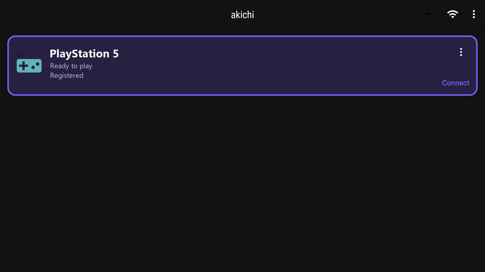
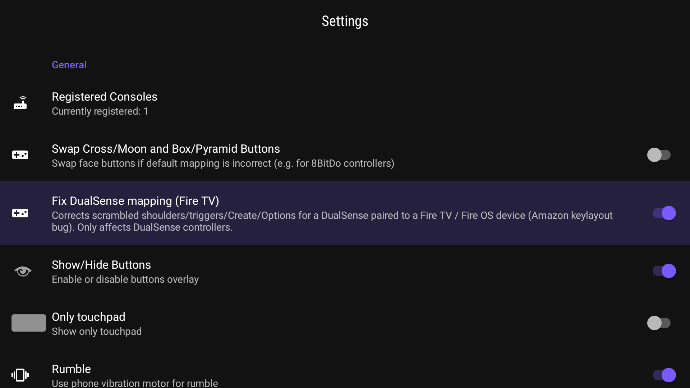
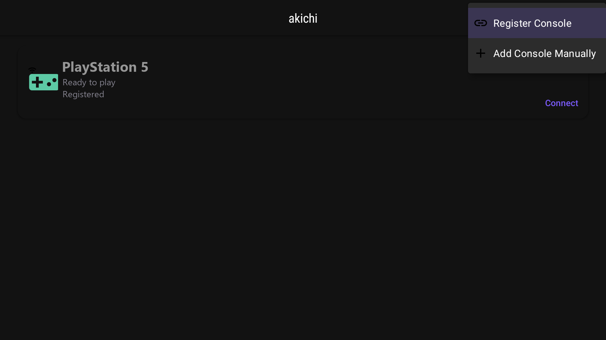
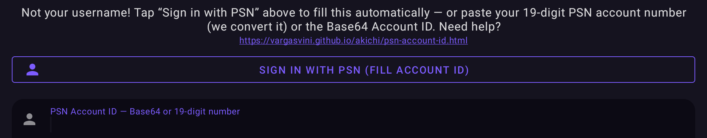
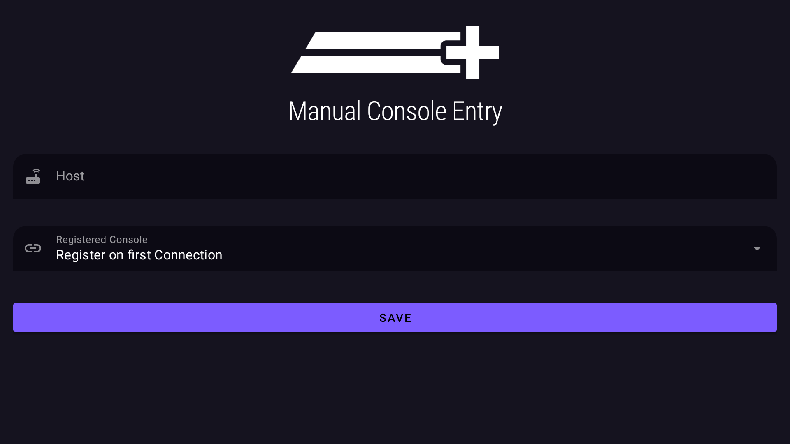

<div align="center">

# akichi

### Remote Play for PS4 & PS5 — built for the TV.

Stream your PlayStation to a **Fire TV** or **Android TV** box and play with a real
controller, over your home network or the internet.

<a href="#install"><b>Download</b></a> ·
<a href="#features"><b>Features</b></a> ·
<a href="#install"><b>Install</b></a> ·
<a href="#building"><b>Build</b></a> ·
<a href="#credits"><b>Credits</b></a>

</div>



> akichi is an independent, open-source project and is **not affiliated with, endorsed
> by, or certified by Sony Interactive Entertainment**. “PlayStation”, “PS4” and “PS5”
> are trademarks of Sony Interactive Entertainment.

---

## Features

akichi is a **TV-first** Remote Play client. It focuses on the living-room experience and
fixes things the desktop/phone forks don’t handle on a TV box.

### 🎮 DualSense controller fix for Fire TV
When a DualSense is paired **directly to a Fire TV** (Fire OS / Android 11–12), the system
delivers a **scrambled button and trigger layout** — L1/R1 behave like L2/R2 and the
Options / Create buttons don’t register. akichi **detects this and corrects the mapping
automatically**, so your controller just works.



### ⚡ Low-latency video
The hardware decoder is configured for **realtime, low-latency** decode (no frame
reordering/lookahead buffering) — meaningfully snappier input-to-screen response.

### 🌈 HDR
Optional **H265 HDR** for richer, brighter colors on HDR-capable TVs. (Streaming is up to 1080p — HDR, not 4K.)

### 📶 Higher bitrate
Push the bitrate up to **100 Mbps** — double the usual ~50 Mbps cap — for the sharpest image your network can handle.

### 📺 TV-first interface
Designed for a remote/controller: **full D-pad navigation**, a clear accent **focus
highlight** so you always know what’s selected, and all actions in the **top bar** — no
hunting for a floating button.



### 🔑 One-tap PSN sign-in (no scripts)
Other Remote Play clients make you dig up your PSN account ID with command-line scripts.
akichi just **signs you in and fills it automatically** — then registers your console.
(Manual entry is still available.)




### 🔄 In-app updates
New versions are detected and installed **in place** — no manual reinstall, your data is kept.

---

## Install

**On Fire TV (one tap):** open the **Downloader** app and enter code **`2031445`** —
it downloads and installs automatically.

**Or manually:** grab `akichi-stable.apk` from the
[**Releases**](https://github.com/vargasvini/akichi/releases/latest) page and `adb install` it.

Then open akichi — your PS5/PS4 appears automatically when it’s on the **same Wi-Fi network**.

> New here? Read about akichi first at **[vargasvini.github.io/akichi](https://vargasvini.github.io/akichi/)** (short link: `aftv.news/3435010`).

**Requirements:** Fire TV / Android TV (Android 11+), a PS4 or PS5 with Remote Play enabled,
and a controller paired to the TV box.

---

## Building

CI builds the app on every push (`.github/workflows/android.yml`). To build locally you need
the Android SDK + NDK (`25.2.9519653`) and CMake; the native library (libchiaki) is compiled
via the bundled CMake project.

```
./gradlew assembleStableDebug
```

The release/CI signing key is injected from a secret, so local debug builds fall back to the
default debug key.

---

## Support akichi

akichi is free and open-source. If it helps you, a tip keeps it updated and improving 💜

* **Ko-fi:** [ko-fi.com/getakichi](https://ko-fi.com/getakichi)
* **GitHub Sponsors:** [github.com/sponsors/vargasvini](https://github.com/sponsors/vargasvini)

## Credits

akichi is a derivative work built on the excellent
[**Chiaki**](https://git.sr.ht/~thestr4ng3r/chiaki) by Florian Märkl and the
[**chiaki-ng**](https://github.com/streetpea/chiaki-ng) community, plus the chiakidroid
Android port. All the hard Remote Play protocol work is theirs — akichi adds the TV-first
experience and the Fire TV fixes on top.

See [`NOTICE`](NOTICE) for full attribution.

## License

akichi is licensed under the **GNU Affero General Public License v3.0** with an OpenSSL
linking exception (`LicenseRef-AGPL-3.0-only-OpenSSL`) — the same license as the upstream
projects it derives from. The complete corresponding source is in this repository.
See [`LICENSE`](LICENSE) / [`COPYING`](COPYING).
